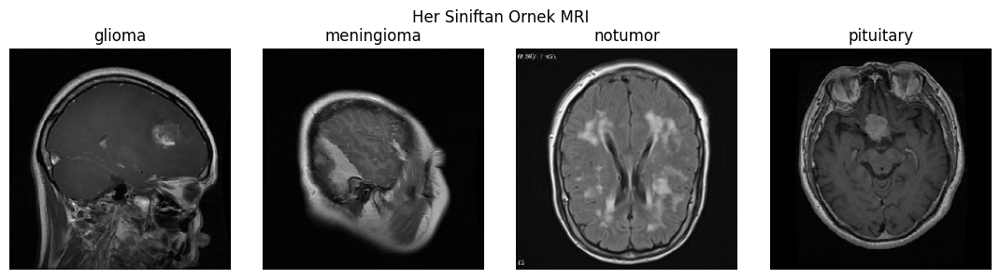
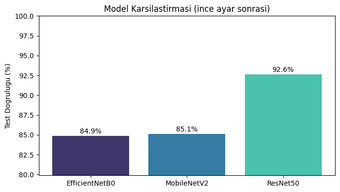
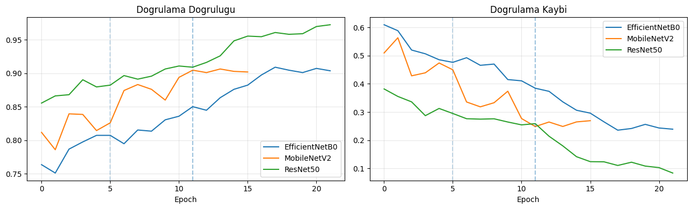
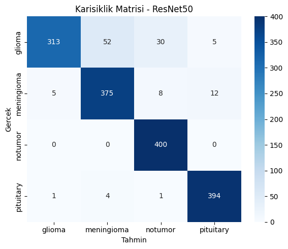
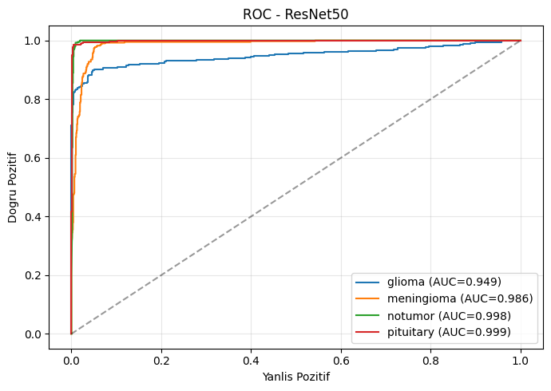
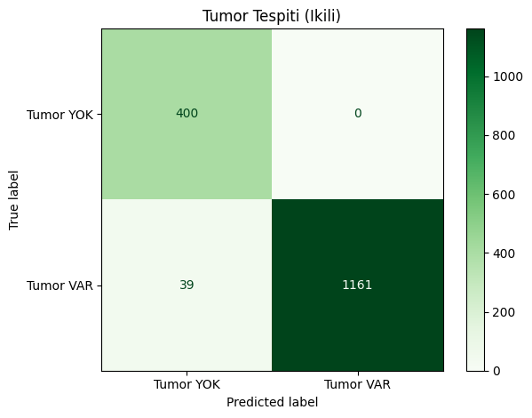

# MRI Görüntülerinden Beyin Tümörü Tespiti ve Sınıflandırılması


MRI görüntülerinden beyin tümörünü tespit eden ve tümör tipini sınıflandıran, transfer öğrenme tabanlı iki aşamalı bir derin öğrenme sistemi.



## Yöntem

- **Veri seti:** [Brain Tumor MRI Dataset](https://www.kaggle.com/datasets/masoudnickparvar/brain-tumor-mri-dataset) (Kaggle). 4 sınıf: `glioma`, `meningioma`, `notumor`, `pituitary`. Eğitim 5600 görüntü (%80 eğitim / %20 doğrulama), test 1600 görüntü.
- **Ön işleme:** 224x224 boyut, mimariye özel normalizasyon, `tf.data` prefetch, otomatik `class_weight`.
- **Veri artırma:** yatay çevirme, döndürme, yakınlaştırma, kontrast ve öteleme.
- **Modeller:** ImageNet ile önceden eğitilmiş EfficientNetB0, MobileNetV2 ve ResNet50.
- **İki fazlı eğitim:** önce taban ağ dondurulur (12 epoch), sonra son %40 katman açılarak ince ayar yapılır (10 epoch).
- **Aşama 1, tespit:** 4 sınıflı tahminler `tümör var / tümör yok` olarak birleştirilir.
- **Aşama 2, sınıflandırma:** tümör tipi belirlenir.

## Sonuçlar

| Model | Test Doğruluğu |
|---|---|
| EfficientNetB0 | %84,88 |
| MobileNetV2 | %85,12 |
| **ResNet50** | **%92,62** |





ResNet50 için karışıklık matrisi ve ROC eğrileri:

<p>
  
  
</p>

En iyi model ResNet50 ile tümör tespiti (ikili) sonuçları:

| Metrik | Değer |
|---|---|
| Doğruluk | %97,56 |
| Duyarlılık (Sensitivity) | %96,75 |
| Özgüllük (Specificity) | %100 |



Ayrıntılı analiz için [proje raporuna](MRI_Beyin_Tumoru_Tespiti_ve_Siniflandirilmasi_Raporu.pdf) bakın.

## Çalıştırma

Notebook Google Colab için hazırlanmıştır (GPU önerilir).

1. `MRI_Beyin_Tumoru_Tespiti_ve_Siniflandirilmasi.ipynb` dosyasını Colab'da açın.
2. Kaggle API anahtarınızı (`kaggle.json`) yükleyin. Notebook veri setini otomatik indirir.
3. Hücreleri sırayla çalıştırın.

Yerelde çalıştırmak için:

```bash
pip install -r requirements.txt
```

Veri setini Kaggle'dan indirip `dataset/Training` ve `dataset/Testing` klasörlerine çıkarın.
